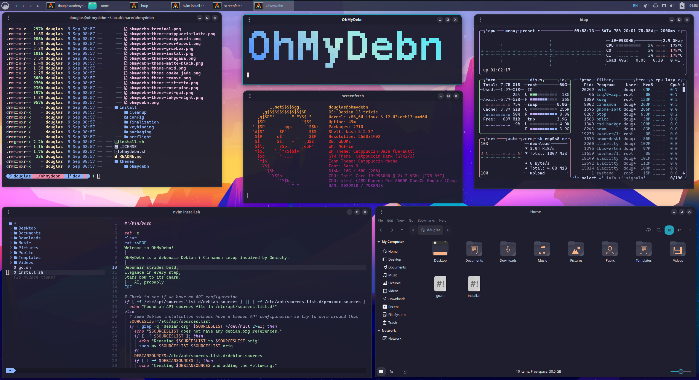
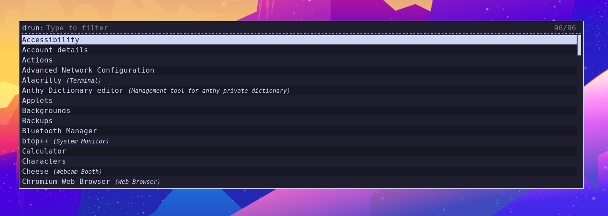

# OhMyDebn

OhMyDebn is a debonair Debian + Cinnamon setup inspired by Omarchy.



# Debonair Haiku

*Debonair strides bold,*  
*Elegance in every step,*  
*Stars bow to its charm.*  
  -- AI, probably

# Motivation

Growing up, my dad introduced me to computers through a [Timex Sinclair](https://en.wikipedia.org/wiki/Timex_Sinclair) and a [Magnavox Odyssey 2](https://en.wikipedia.org/wiki/Magnavox_Odyssey_2). In 1984, I got a [Commodore 16](https://en.wikipedia.org/wiki/Commodore_16) and, of course, the very first thing I typed was `PRINT "DOUG IS COOL"`. The first real program I wrote mapped the F1 key to do the same thing. So apparently I've been using the command line and hotkeys for (checks notes) over 40 years now!

Over the years, I transitioned from the Commodore 16 to the [Commodore 128](https://en.wikipedia.org/wiki/Commodore_128) and then into the PC world starting with an [Epson Apex](https://en.wikipedia.org/wiki/Epson_Equity). I had several different PC systems running [MS-DOS](https://en.wikipedia.org/wiki/MS-DOS) and [Windows 3.1](https://en.wikipedia.org/wiki/Windows_3.1). In December of 1997, I discovered [Linux](https://en.wikipedia.org/wiki/Linux) and my entire career changed. In 2008, I started the [Security Onion](https://github.com/Security-Onion-Solutions/securityonion) project to build a specialized Linux platform for cybersecurity. Security Onion is great for cybersecurity, but it's not designed to be a general purpose desktop environment.

Every year or so, I review my desktop environment to make sure I'm using the best tools for the job. Starting from [first principles](https://en.wikipedia.org/wiki/First_principle), I consider needs, desires, and workflows and ask myself a few questions: 
- What are the best of breed productivity apps that help me get my job done with a minimum amount of fuss? 
- What is the best terminal and command line environment?
- What is the Linux desktop environment that allows me to work with all of those applications at the same time most efficiently?
- How can I use hotkeys to keep hands on keys for better ergonomics and more speed?
- Which Linux distro provides all of the above and runs on the hardware that I need it to?

I've been inspired by [DHH](https://dhh.dk/) and his [Omakub](https://omakub.org/) and [Omarchy](https://omarchy.org/) setups to not only build my ideal desktop environment but publish it here so that others can benefit as well. This is my own personal [omakase](https://en.wikipedia.org/wiki/Omakase) menu, a curated collection of comprehensive components that balances the ideals of productivity, flexibility, and beauty while offering a modern command line experience and some fun 8-bit nostalgia as well.

# Ingredients

- Base OS: [Debian](https://www.debian.org/) 13 for stability and compatibility
- Desktop environment: [Cinnamon](https://github.com/linuxmint/Cinnamon) for a premium desktop experience
- Window themes: artfully polished themes from [Linux Mint](https://linuxmint.com/)
- Wallpaper: beautiful [Catppuccin mountain landscape](https://github.com/zhichaoh/catppuccin-wallpapers/blob/main/landscapes/salty_mountains.png)
- Terminal emulator: [Alacritty](https://alacritty.org/) with Caskaydia Nerd Fonts and [Catppuccin Mocha theme](https://github.com/catppuccin/alacritty)
- Shell: [Zsh](https://en.wikipedia.org/wiki/Z_shell) with [Oh My Zsh](https://ohmyz.sh/) and [Catppuccin theme for syntax highlighting](https://github.com/catppuccin/zsh-syntax-highlighting)
- Shell prompt: [Starship](https://starship.rs/) with modified [Catppuccin theme](https://github.com/catppuccin/starship)
- Shell improvements: [Zoxide](https://github.com/ajeetdsouza/zoxide) for a smarter `cd` command and [eza](https://github.com/eza-community/eza) for beautiful directory listings
- Text editor: [neovim](https://neovim.io/) with [LazyVim](https://www.lazyvim.org/) and [Catppuccin theme](https://github.com/catppuccin/nvim)
- Web browser: [Chromium](https://www.chromium.org/Home/) with uBlock Origin Lite content blocker
- Password management: [KeePassXC](https://keepassxc.org/)
- Default image viewer: [Ristretto](https://docs.xfce.org/apps/ristretto/start)
- Image editor: [GIMP](https://www.gimp.org/)
- Performance monitoring: [btop](https://github.com/aristocratos/btop) with [Catppuccin Mocha theme](https://github.com/catppuccin/btop)
- System summary: [screenfetch](https://github.com/KittyKatt/screenFetch)
- Window automation: [xdotool](https://github.com/jordansissel/xdotool)
- Office Suite: [LibreOffice](https://www.libreoffice.org/)
- App launcher: [Rofi](https://davatorium.github.io/rofi/current/rofi.1/)
- Eye candy: dazzling terminal effects via [tte](https://github.com/ChrisBuilds/terminaltexteffects) for demoscene nostalgia

# Why Debian?

Here are my requirements for a base OS:
- can run on bare metal and virtualized
- can be virtualized via Proxmox, Parallels, and other hypervisors
- must be supported by Parallels Tools
- must support x86 and ARM architectures

Debian satisfies these requirements and is well known for stability, simplicity, and versatility.

# Why Cinnamon?

Here are my requirements for a desktop environment:
- must be available on Debian
- able to support a traditional program menu
- able to support a traditional taskbar with the ability to re-arrange the order in which running programs are listed
- support hotkeys
- stable and reliable
- relatively light on resources
- must be responsive and not slow me down

Cinnamon satisfies these requirements and has some nice eye candy!

# Why Debian Cinnamon?

Why use Debian Cinnamon instead of Linux Mint or Linux Mint Debian Edition (LMDE)? Linux Mint and LMDE are great, but there are a few reasons why you might want to use Debian 13 Cinnamon instead:
- Linux Mint is only available for x86 architecture. If you're on ARM, you need a distro compiled for ARM that can run Cinnamon (like Debian). Please note that this script has not yet been tested on ARM but it should be easy to make it work.
- Suppose you want to take a Debian 13 derivative (like Proxmox 9) and add the Cinnamon desktop. You can then use this script to turn it into OhMyDebn!
- For fun and for science!
  
# Why is it called "OhMyDebn"?

There are several meanings for the name:
- It is my [omakase](https://en.wikipedia.org/wiki/Omakase) menu for Debian
- It's so debonair, it will make your friends say "Oh my!" or "Oh! My Debian installations never looked this good!"
- Obligatory [recursive acronym](https://en.wikipedia.org/wiki/Recursive_acronym) OHMYDEBN: OhMyDebn Heals My Yearning for a Desktop Environment Base Now!

# Gallery

Here's my OhMyDebn battle station! It's a MacBook Pro running MacOS and Parallels with 3 VMs: one VM is my daily driver where I do most of my work and the other two are test VMs.


Here's an old MacBook from 2014. Apple says it's EOL but OhMyDebn breathes new life into it!


# Requirements

OhMyDebn requires the following:
- 2GB RAM minimum
- 2 CPU cores minimum
- Debian 13
- non-root user account with sudo privileges
- curl
- ability to connect to Github, package repos, and other Internet sites
  
# Warnings

This script:
- is intended for a clean new installation
- may make changes to your APT configuration
- will remove apps like FireFox, Thunderbird, and others (unless you use the `--no-uninstall` option)

This script is totally unsupported. If it breaks your system, you get to keep both pieces!

# Installation

1. Download the Debian Live 13 Cinnamon ISO image from https://cdimage.debian.org/debian-cd/current-live/amd64/iso-hybrid/ and install it. Reboot into your newly installed Debian 13 Cinnamon and the default desktop should look like this:

2. In your Debian 13 Cinnamon desktop, download the script:
```
curl -O https://raw.githubusercontent.com/dougburks/ohmydebn/refs/heads/main/install.sh
```
3. Once you have reviewed install.sh and the rest of the code in this repo, you can run the install script:
```
bash install.sh
```
## Installation Options

The install script supports the following option:

- `--no-uninstall` - installs OhMyDebn without removing existing packages like Firefox, Thunderbird, etc.

Example:
```
bash install.sh --no-uninstall
```
# After Installation

Once installation completes, you can enjoy your new OhMyDebn desktop!


# Launch applications via Rofi

To run applications, you can open the traditional program menu or just press Super + Space to bring up the Rofi application launcher. You can then use arrow keys to select which application you'd like to run.



# Web browser

To start a web browser, you can open it from the traditional program menu or just press Super + B. This launches [Chromium](https://www.chromium.org/Home/) with the uBlock Origin Lite content blocker already installed for you.


# OhMyDebn Logo

To show the OhMyDebn logo in all of its glory, press Shift + Ctrl + O.


# System summary via screenfetch

To see a system summary, press Shift + Ctrl + S to launch screenfetch.


# System monitoring via btop

To monitor your system performance, press Super + T to launch btop.


# Terminal

To start a terminal session, press Super + Enter. This launches a beautiful and powerful [Alacritty](https://alacritty.org) terminal window that includes:
- Caskaydia Nerd Fonts
- [Catppuccin Mocha theme](https://github.com/catppuccin/alacritty)
- [Zsh](https://en.wikipedia.org/wiki/Z_shell) shell with [Oh My Zsh](https://ohmyz.sh/) and [Catppuccin theme for syntax highlighting](https://github.com/catppuccin/zsh-syntax-highlighting)
- [Starship](https://starship.rs/) shell prompt with modified [Catppuccin theme](https://github.com/catppuccin/starship)
- [Zoxide](https://github.com/ajeetdsouza/zoxide) for a smarter `cd` command
- [eza](https://github.com/eza-community/eza) for beautiful directory listings via `ls` and `lt`


# Text editor

To start a text editor, press Super + N. This launches the beautiful and powerful combination of Neovim with LazyVim. The first time it loads, it will install several plugins. Once that is done, you can press the Q key until you get to the main menu. You can then press the space bar and then the E key to open Explorer.


The hotkeys section below includes more hotkeys for Neovim and a link to additional information.

# Hotkeys

Pressing Super + K will open Chromium and navigate to this list of keyboard bindings.

## OhMyDebn

| Hotkey | Function |
|--------|----------|
| Ctrl+Shift+O | OhMyDebn logo |
| Ctrl+Shift+S | screenfetch system summary |

## Windows

| Hotkey | Function |
|--------|----------|
| Alt+Tab | Cycle through open windows |
| Shift+Alt+Tab | Cycle backwards through open windows |
| Alt+Space | Activate window menu |
| Alt+F7 | Move window |
| Super+W | Close window |
| Super+D | Show desktop (minimize all windows) |
| Super+Left | Push window left |
| Super+Right | Push window right |
| Super+Up | Push window up |
| Super+Down | Push window down |
| Super+PageUp | Maximize window |
| Super+PageDown | Minimize window |
| Ctrl+Alt+Down | Window selection |

## Workspaces

| Hotkey | Function |
|--------|----------|
| Super+1 | Switch to workspace 1 |
| Super+2 | Switch to workspace 2 |
| Super+3 | Switch to workspace 3 |
| Super+4 | Switch to workspace 4 |
| Ctrl+Alt+Up | Workspace selection |
| Ctrl+Alt+Left | Switch to left workspace |
| Ctrl+Alt+Right | Switch to right workspace |
| Shift+Ctrl+Alt+Left | Move window to left workspace |
| Shift+Ctrl+Alt+Right | Move window to right workspace |

## System

| Hotkey | Function |
|--------|----------|
| Ctrl+Alt+L | Lock screen |
| Ctrl+Alt+Del | Logout |
| Ctrl+Alt+End | Shut down |
| Ctrl+Alt+Escape | Restart Cinnamon desktop |

## Apps

| Hotkey | Function |
|--------|----------|
| Super+Space | Application Launcher (Rofi) |
| Super+Return | Terminal (Alacritty) |
| Super+B | Browser (Chromium) |
| Super+F | File Manager (Nemo) |
| Super+T | btop |
| Super+N | Neovim |
| Alt+F2 | Run dialog |

## Password and Bookmark Management (KeePassXC)

| Hotkey | Function |
|--------|----------|
| Ctrl+Shift+K | Open or activate KeePassXC |
| Ctrl+Shift+U | Open browser tab to selected URL |
| Ctrl+Shift+P | Auto-type username and password for selected site |
| Ctrl+N | Create a new entry in KeePassXC |
| Ctrl+E | Edit entry |
| Ctrl+B | Copy username |
| Ctrl+C | Copy password |
| Ctrl+U | Copy URL |

## Configuration

| Hotkey | Function |
|--------|----------|
| Shift+Super+N | Network Manager |
| Shift+Super+S | Sound menu |

## Capture

| Hotkey | Function |
|--------|----------|
| Shift+Print | Take a screenshot of an area |
| Shift+Ctrl+Print | Copy a screenshot of an area to clipboard |
| Print | Take a screenshot |
| Ctrl+Print | Copy a screenshot to clipboard |
| Alt+Print | Take a screenshot of a window |
| Ctrl+Alt+Print | Copy a screenshot of a window to clipboard |

## Notifications

| Hotkey | Function |
|--------|----------|
| Super+N | Show notifications |
| Shift+Super+C | Clear notifications |

## Neovim (with LazyVim)

### Navigation

| Hotkey | Function |
|--------|----------|
| Space | Show command options |
| Space Space | Open file via fuzzy search |
| Space E |	Toggle sidebar |
| Space G G | Show git controls |
| Space S G | Search file content |
| Ctrl + W W | Jump between sidebar and editor |
| Ctrl + Left/right arrow | Change size of sidebar |
| Shift + H | Go to left file tab |
| Shift + L | Go to right file tab |
| Space B D | Close file tab |

### While in sidebar

| Hotkey | Function |
|--------|----------|
| A | Add new file in parent dir |
| Shift + A | Add new subdir in parent dir |
| D | Delete highlighted file/dir |
| M | Move highlighted file/dir |
| R | Rename highlighted file/dir |
| ? | Show help for all commands |

For the full list of all Neovim hotkeys configured by LazyVim, please see https://www.lazyvim.org/keymaps.

# Relationship to Security Onion project and Security Onion Solutions

OhMyDebn is not directly related to the [Security Onion](https://github.com/Security-Onion-Solutions/securityonion) project. OhMyDebn is sponsored by [Security Onion Solutions](https://securityonion.com) (SOS); however, SOS does not provide any technical support for it. OhMyDebn is intended to provide a general purpose desktop environment so, of course, you could use the included Chromium web browser to connect to your [Security Onion Console](https://docs.securityonion.net/en/2.4/soc.html)!
